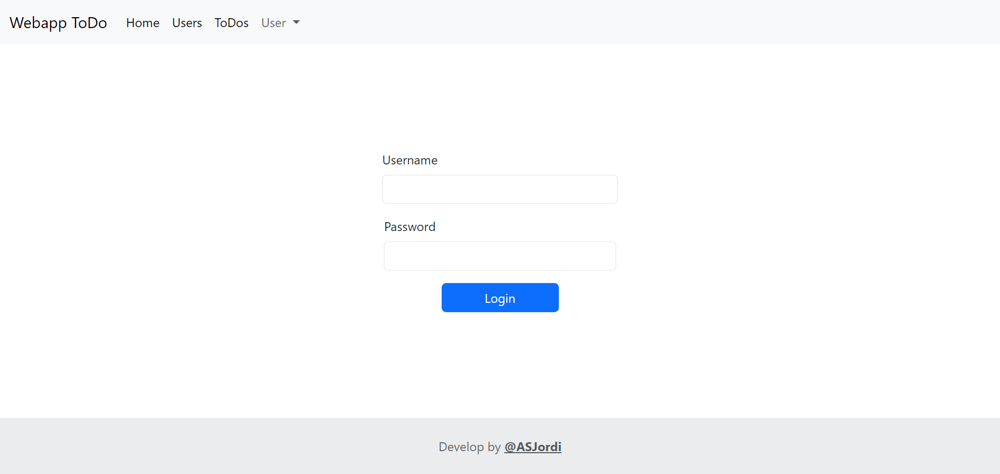
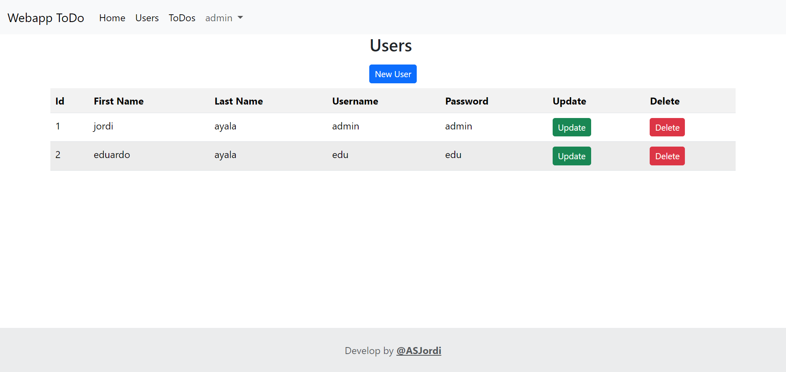
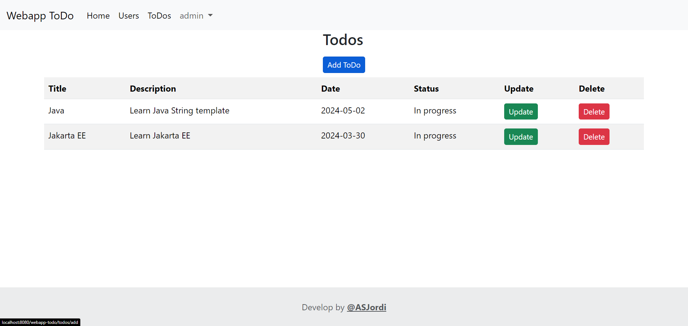

<div align="center">
  <h1 align="center"><a href="https://github.com/ASJordi/webapp-todo">TODO App</a></h1>

  <p align="center">TODO App with Java and Jakarta EE</p>
</div>

## About :computer:

TODO App is a web application to manage tasks and users. It is developed with Java and Jakarta EE. It has a login system, user management, and task management. Tomcat is used as a server.





## Stack :hammer_and_wrench:

* Java SE
* Jakarta EE
* JSP
* JSTL
* CDI
* Tomcat
* MySQL
* Docker
* Bootstrap

## Installation :gear:

> You can run the application in a Docker container or in your local environment.

> If you don't want to build the application, you can download the Docker image from the [Packages section](https://github.com/ASJordi/webapp-todo/pkgs/container/webapp-todo)

### Docker :whale:

- Build the Docker image

  ```bash
  docker build -t todo-app .
  ```

- Run the Docker container

  ```bash
    docker container run -p 8080:8080 todo-app
  ```
  
- Use `docker-compose` to run the application with MySQL and PhpMyAdmin

  ```bash
  docker compose up -d
  ```

> Make sure to create the database with the script in `src/main/resources/db/db.sql` before running the application.

### Local :computer:

- Clone the repository

  ```bash
  git@github.com:ASJordi/webapp-todo.git
  ```

- Create a MySQL database with the script in `src/main/resources/db/db.sql`

- Configure the database connection in `src/main/webapp/META-INF/context.xml`

- Install dependencies with Maven

- Configure tomcat to use the MySQL connector

- Run the application with:

  ```bash
  mvn tomcat7:redeploy
  ```

## License :page_facing_up:

Distributed under the MIT License. See `LICENSE` for more information.

## Contact :email:

Jordi Ayala - [@ASJordi](https://twitter.com/ASJordi)

Project Link: [https://github.com/ASJordi/webapp-todo](https://github.com/ASJordi/webapp-todo)
